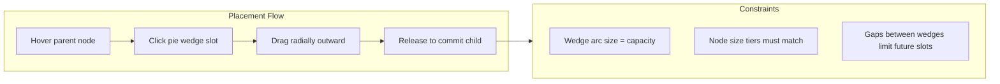
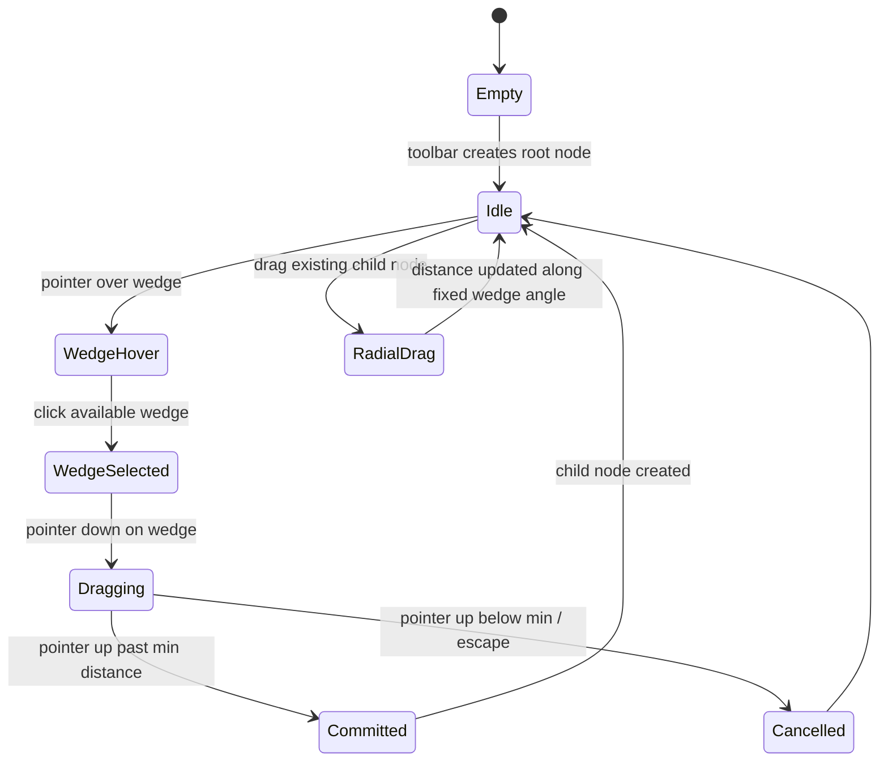

# Nodal Builder UI Component Library

Build a standalone React + SVG component library in `node-builder` that faithfully implements [Squidi Mechanic #147](https://www.squidi.net/three/entry.php?id=147)'s pie-wedge node placement system — with modern vector styling, drag-to-place interactions, angular capacity rules, and size-tier constraints — without RTS game logic.

## Decisions

| Topic | Choice |
|-------|--------|
| Stack | React + SVG |
| Wedge fidelity | Full system — angular slots, capacity limits, drag-to-set distance, size tiers |
| Visual style | Modern vector interpretation (not retro pixel-art) |
| Scope | Standalone component library, no game logic |
| Repositioning | **Radial only** — existing children stay locked to their parent wedge angle; drag adjusts distance only |
| Demo seed | **None** — empty canvas on load; user creates the first root node via toolbar |
| Component docs | **Demo app only** — no Storybook |

---

## What Mechanic #147 Describes

The core idea is **angular slot allocation on circular nodes**, inspired by [Moonbase Commander](http://www.mobygames.com/game/windows/moonbase-commander). This is not a generic mind-map.



### Image reference

| Image | What it shows | UI relevance |
|-------|---------------|--------------|
| [nodal1](https://www.squidi.net/three/set08/img/entry147-nodal1.png) | Mature network on checkerboard map | End-state visual: size hierarchy, hub vs leaf |
| [nodal2](https://www.squidi.net/three/set08/img/entry147-nodal2.png) | Gray wedge → brown active → green drag line | Core interaction: wedge select, radial drag |
| [nodal3](https://www.squidi.net/three/set08/img/entry147-nodal3.png) | Pie-chart hub with 4 children at varying distances | Wedge capacity; distance set per drag |
| [nodal4](https://www.squidi.net/three/set08/img/entry147-nodal4.png) | Edge insertion + branched hub | Mid-edge node type splits connections |
| [nodal5](https://www.squidi.net/three/set08/img/entry147-nodal5.png) | Resource zone with satellite nodes | Optional later — game layer, not v1 |
| [poster](https://www.squidi.net/three/poster/poster147.png) | Sparse hub vs dense network | Growth via repeated wedge placement |

### Mechanics to implement

1. **Pie wedges as ports** — each node exposes angular slots; selecting one enters placement mode
2. **Radial drag placement** — child position = parent center + distance along wedge bisector angle
3. **Angular capacity** — wedge `arcDegrees` consumes parent perimeter; wedges cannot overlap; gaps may block future slots
4. **Size tiers** — small / medium / large nodes; wedge size must match parent tier; bridge nodes convert between tiers
5. **Edge insertion nodes** — 2-wedge node snapped onto an existing edge, splitting it for branching
6. **Radial repositioning** — dragging an existing child adjusts distance along its fixed wedge angle only (no free XY)

### Out of scope (v1)

- RTS resources, harvesting, unit production
- Map terrain / fog of war
- Real-time simulation
- Resource zones (nodal5)
- Chronos Tactics timeline integration ([#142](https://www.squidi.net/three/entry.php?id=142))
- Storybook

---

## Architecture

Scaffold with Vite + React + TypeScript.

```
node-builder/
├── docs/
│   └── plan.md
├── src/
│   ├── components/
│   │   ├── NodeGraph.tsx          # SVG viewport, pointer routing, zoom/pan
│   │   ├── NodeCircle.tsx         # circle + wedge overlays
│   │   ├── WedgeSector.tsx        # interactive pie slice
│   │   ├── ConnectionEdge.tsx     # parent→child line
│   │   ├── PlacementPreview.tsx   # green drag line + ghost node
│   │   └── EdgeInsertHandle.tsx   # midpoint affordance on edges
│   ├── hooks/
│   │   ├── useNodeGraph.ts        # graph state + mutations
│   │   └── usePlacementDrag.ts    # wedge select → radial drag FSM
│   ├── lib/
│   │   ├── geometry.ts            # polar math, arc overlap, hit tests
│   │   ├── wedgeCapacity.ts       # slot validation, gap detection
│   │   └── sizeTiers.ts           # tier compatibility + bridge rules
│   ├── types/
│   │   └── graph.ts               # Node, Wedge, Edge, NodeKind
│   └── demo/
│       └── App.tsx                # interactive playground (empty start)
```

### Data model

```typescript
type NodeSize = 'small' | 'medium' | 'large';

type WedgeState = 'available' | 'active' | 'occupied' | 'reserved';

interface Wedge {
  id: string;
  startAngle: number;   // radians, 0 = east, CCW
  arcDegrees: number;
  state: WedgeState;
  childNodeId?: string;
}

interface Node {
  id: string;
  kind: 'standard' | 'bridge' | 'edge-insert';
  size: NodeSize;
  x: number;
  y: number;
  wedges: Wedge[];
  parentId?: string;
  parentWedgeId?: string;
  distance?: number;    // radial offset from parent along wedge angle
}
```

### Interaction state machine



### Geometry essentials (`src/lib/geometry.ts`)

- `wedgeBisectorAngle(wedge) → angle` — child placement direction
- `pointOnRay(origin, angle, distance) → {x, y}`
- `radialDistance(parent, child, angle) → number` — project child onto wedge ray
- `wedgesOverlap(a, b) → boolean` — arc interval collision
- `wedgeHitTest(node, pointer) → wedgeId | null`
- `edgeMidpoint(parent, child) → {x, y}` — for insert handles

### Visual language

Modern interpretation of Squidi's semantic colors:

- Nodes: white/light fill, subtle stroke; radii 12 / 20 / 32px by tier
- Wedges: `available` = faint gray; `active` = warm gold/amber; `occupied` = muted fill
- Placement preview: green dashed radial line + semi-transparent ghost circle
- Connections: thin neutral gray, parent perimeter → child center at wedge angle
- Hub nodes: multi-color wedge sectors showing all slot states (nodal3 pattern)
- Selection: soft ring highlight

---

## Implementation phases

### Phase 1 — Scaffold + render

- Vite/React/TS project setup
- `NodeGraph` SVG canvas with pan/zoom
- Render nodes, wedge sectors, edges from graph state
- Size-tier radius mapping
- Empty canvas on load

### Phase 2 — Wedge selection + radial placement

- Wedge hover/click hit testing
- `usePlacementDrag`: select wedge → drag → preview line → commit child
- Min/max placement distance enforcement
- Wedge state transitions: available → active → occupied

### Phase 3 — Capacity + tier rules

- Arc overlap prevention
- Gap analysis: warn/block when remaining arc too small
- Size-tier compatibility (medium wedge on medium node, etc.)
- Bridge node: one large + one medium wedge on same node

### Phase 4 — Edge insertion

- Midpoint handle on existing edges
- Insert `edge-insert` node, split edge into two segments
- Pre-claim 2 wedges on inserted node

### Phase 5 — Reposition + polish

- Radial-only drag on existing children (distance along fixed wedge angle)
- Delete node / collapse subtree
- Demo toolbar: create root node, pick node kind/size, reset canvas
- Keyboard: Escape cancels placement, Delete removes selected

---

## Success criteria (v1)

- Empty canvas loads; user creates first root node from toolbar
- Click available wedge → drag outward → release → child appears at correct angle and distance
- Dragging existing child moves it only along its parent wedge ray
- Overlapping wedges blocked; wedge states visually distinct
- Size tiers enforced with clear disabled/error feedback
- Edge insertion works on any connection
- No game dependencies; demo app serves as the sole showcase (no Storybook)

## Todos

- [x] **scaffold** — Vite + React + TypeScript project with empty SVG demo shell
- [x] **data-model** — Graph types, geometry utils, wedge capacity / size-tier validation
- [x] **render** — NodeGraph, NodeCircle, WedgeSector, ConnectionEdge components
- [x] **placement** — Wedge select + radial drag placement with preview line
- [x] **constraints** — Arc overlap, gap rules, size-tier compatibility
- [x] **edge-insert** — Midpoint insertion node type and split-edge rendering
- [x] **demo** — Interactive playground with toolbar (create root, reset) and keyboard shortcuts